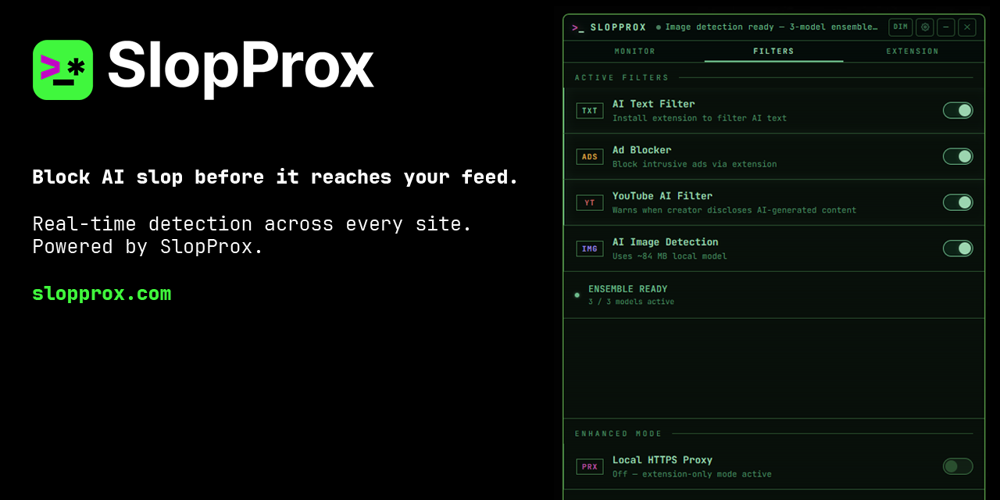

# SlopProx: AI Slop Filter



A Windows desktop app that detects and hides AI-generated content — text, images, and YouTube videos — as you browse, in real time, on-device.

**[slopprox.com](https://slopprox.com)** &nbsp;·&nbsp; **[SlopProx Pro](https://pro.slopprox.com)**

---

## What it does

- **AI text detection** — flags AI-generated paragraphs as you browse, using a hybrid heuristic + two-model on-device ML ensemble
- **AI image detection** — 3-model ONNX ensemble with metadata forensics (extension required)
- **YouTube AI filter** — intercepts videos where the creator declared synthetic/AI content
- **Ad blocking** — blocked via the extension's declarative net request rules; network-level with Enhanced Mode enabled

Detected content is replaced with a placeholder. One click to reveal the original.

---

## How it works

### Default mode (extension only)

After installation the app runs a local service on port 8083. The browser extension connects to it and handles:

- Social media card-level text classification (heuristic + ML ensemble)
- AI image detection (3-model on-device ONNX pipeline)
- Ad blocking via declarative net request rules
- YouTube AI video feed badges

Text filtering, ad blocking, and the YouTube filter are **active as soon as the app starts**. Image detection activates once the extension is installed and the on-device models finish loading.

No certificate is required. No system settings are changed.

### Enhanced Mode (local HTTPS proxy)

Enhanced Mode is an opt-in feature for power users. Enabling it starts a local HTTPS proxy that intercepts browser traffic via a PAC file, injecting detection scripts into every page — including browsers and apps not covered by the extension.

Enabling the proxy installs a self-signed CA certificate into the Windows user certificate store (no admin rights required). If installation fails the proxy turns itself off automatically. The certificate can be reinstalled at any time from the dashboard.

Enhanced Mode adds:
- System-wide filtering across **all browsers and apps**, not just the extension browser
- Network-level ad blocking (HTTP 204 responses)
- Full-page text injection beyond social media cards

| Feature | Default | Enhanced Mode |
|---|---|---|
| Social card text filtering | ✓ | ✓ |
| AI image detection | ✓ (extension) | ✓ |
| Ad blocking | ✓ (extension DNR) | ✓ + network-level |
| YouTube filter | ✓ | ✓ |
| All-browser / all-app coverage | — | ✓ |
| CA certificate required | No | Yes (auto-installed) |

---

## Installation

1. Download the installer from the [Releases](../../releases) page
2. Run `SlopProx Setup.exe`
3. The app starts in the system tray — text filtering, ad blocking, and the YouTube filter are active immediately

### Browser extension (recommended)

Required for image detection, social media filtering, and YouTube feed badges.

1. Open the dashboard and click **Install Extension**
2. Choose your browser — Chrome Web Store or Firefox Add-ons — and install in one click

Or install directly:
- **Chrome / Edge / Brave / Vivaldi:** [Chrome Web Store](https://chromewebstore.google.com/detail/slopprox/nfbpghkbijdkkfbceienbgbjkeobglib)
- **Firefox:** [Firefox Add-ons](https://addons.mozilla.org/en-US/firefox/addon/slopprox/)

---

## Development

**Requirements:** Node.js 18+, Windows

```bash
git clone https://github.com/ross-walpole/SlopProx.git
cd SlopProx
git lfs pull      # downloads the bundled ONNX image model (~84 MB)
npm install
npm start         # Electron dev mode
npm run build     # builds NSIS installer -> dist/
```

The primary image model (~84 MB) is bundled via Git LFS. The two text models and two additional image ensemble models download from HuggingFace on first use and are cached in `userData`.

### Project structure

| File | Role |
|---|---|
| `main.js` | Electron main process — window, tray, IPC |
| `proxy.js` | HTTPS MITM proxy — HTML injection, ad blocking |
| `service.js` | Local HTTP API (`:8083`) for the extension |
| `classifier.js` | All detection logic — text heuristics, ML ensemble, image pipeline |
| `config.js` | Single source of truth for all tunable detection parameters |
| `counts.js` | Persistent session counters |
| `logger.js` | Structured debug logging |
| `pac.js` | PAC file routing rules |
| `state.js` | Shared runtime feature flags |
| `extension/` | Browser extension (Chrome MV3 + Firefox) |
| `models/` | Bundled ONNX image model — Model A (Git LFS) |

---

## SlopProx Pro

[SlopProx Pro](https://pro.slopprox.com) is a standalone Chrome and Firefox extension for professional use — no desktop app, no proxy, no certificate. Designed for newsrooms, universities, and research teams. Right-click any text or image for a full forensic breakdown.

---

## Licence

**GPL-3.0-only**, see [LICENSE](./LICENSE).

Free and open source. Forks must remain open source under the same terms.

Copyright (C) 2026 Ross Walpole.
